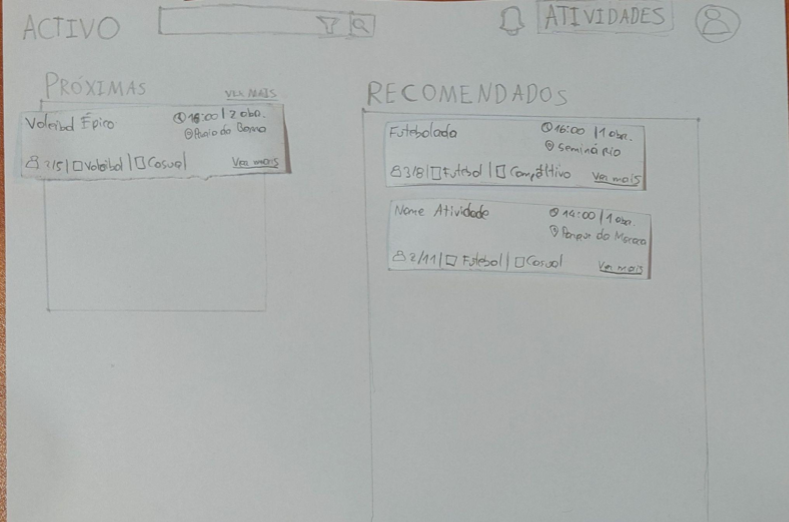
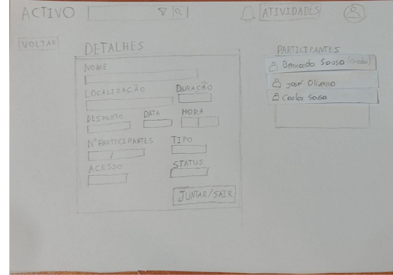
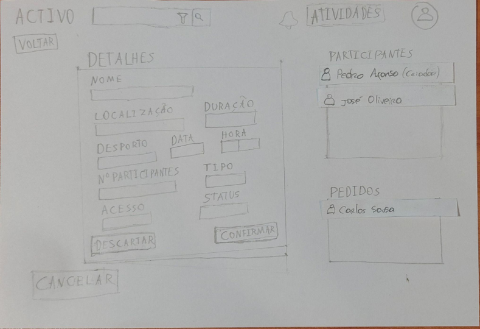

[Back to main Logbook Page](../hci_logbook.md)

---
# Low Fidelity Prototype and Evaluation

## D.1. Low Fidelity Prototype

Decidimos fazer um protótipo em papel para tornar mais fácil a esquematização do design e fazer qualquer alteração necessária para além disso o aspeto de protótipo leva o utilizador a sentir um maior conforto a apresentar sugestões na secção de notas está apresentada o sketch da estrutura e informações adicionais sobre a realização do mesmo.

## D.2. Prototype Evaluation
Para a avaliação do prótotipo elaboramos tarefas que consideramos importantes no contexto do nosso sistema e efetuamos testes em que os utilizadores as executavam analisando o seu comportamento e reações na execução das mesmas seguidas de perguntas pós tarefa para obter feedback especifico por tarefa.

Relativamente ao prototipo de baixa fidelidade em papel recebemos o seguinte feedback nos testes realizados (4 em aula com outros estudantes e 1 fora de aula com uma pessoa não relacionada à disciplina)

Feedback:
    Melhorias na clareza da pesquisa especialmente a distância.
    Apresentação de data e hora de forma mais clara
    Conceito de status ficar mais esplicito para utilizadores não familiarizados com o sistema
    Colocar uma opçõ de criar no main screen uma vez que é uma feature principal e assim reduzimos o numero de clicks para a execução de uma das principais tarefas do sistema.
    Maior clareza no que são os filtros.
    Separação de detalhes estáticos e dinâmicos ou maior clareza de distinção.
    Barra de pesquisa não necessária em todas as páginas.

---
[Back to main Logbook Page](../hci_logbook.md)

---